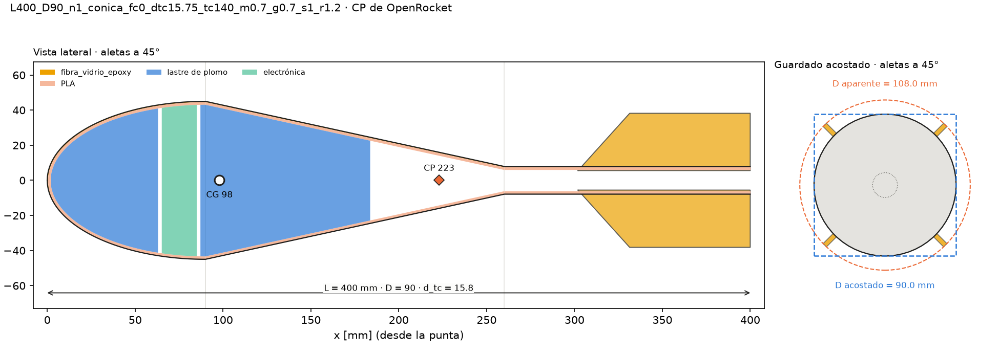

# sensor-tipo2 · DBF 2026-27 (UPB)

Optimización de la geometría y del lastre de plomo del **sensor remolcado tipo 2**
(`modelos/analisis_tipo2.ork`): nariz + cuerpo (cilíndrico o abombado) + transición + **tubo de
cola** delgado con aletas freeform montadas sobre el tubo. Sigue la metodología de
[`dbf-sensor`](https://github.com/Santyrios514/dbf-sensor) (`sensor_opt`): barrido en malla con un
CP sustituto (Barrowman interno, sin JVM) y verificación de los mejores con OpenRocket 24.12. El
paquete es autocontenido; no importa `dbf-sensor`.

**Spec v2** (`SPEC_sensor_tipo2_v2.md`): aletas **dentro de 1.2 R** ($r_{tip} \le 1.2\,R$,
restricción dura que nunca se relaja), $L \le 400$ mm, cuerda de raíz considerable, tubo de cola
delgado, tope de masa de 11.5 kg y objetivo masa ≫ D aparente ≫ taper ≫ SM. Lo que no es geometría
funciona como en `dbf-sensor`: pared fibra de vidrio 0.3 mm + PLA 1.5 mm, electrónica de 20 mm y
150 g, herraje de 15 g, plomo macizo con tapón delantero y trasero, amarre en el CG con tolerancia
mínima (**1.2 mm**), V = 30 m/s a 1495 m (ISA).

## ¿Es viable?

1. **Sí.** Con 4 aletas, $r_{tip} \le 1.2\,R$ y $L \le 400$ mm hay **159 384 candidatos factibles**
   (de 1.21 millones evaluados); el ganador está verificado con OpenRocket (SM 1.39).
2. Admite como máximo **6.45 kg** (56 % de los 11.5 kg), con D = 90 mm (el máximo de la malla) y
   D aparente 108 mm; la limita la tolerancia del amarre en toda la frontera.
3. Para llegar a 11.5 kg la concesión mínima es **8 aletas con $r_{tip} = 1.3\,R$** (o 6 aletas a
   1.6 R; con 1.4 R llegan a 11.4 kg); con 4 aletas no se llega ni con 1.6 R (10.9 kg). Fuera de la malla, más D también
   ayuda (D = 100 mm: 8.0 kg).

## Ganador (verificado con OpenRocket 24.12)



`modelos/ganador_v2_D90.ork` (con el plomo, la electrónica y el herraje como *Mass components*) y
`modelos/ganador_v2_D90_perfil.csv` (casco exterior/interior cada 0.5 mm y polígono de la aleta).

| | `L400_D90_n1_conica_fc0_dtc15.75_tc140_m0.7_g0.7_s1_r1.2` |
|---|---|
| Cuerpo | **abombado** ($f_c = 0$, $L_c = 0$): nariz elipsoide 90 mm + transición cónica 170 mm (θ = 12.3°) |
| Tubo de cola | Ø 15.75 × 140 mm ($k = 0.175$, $L_{tc}/d_{tc} = 8.9$) |
| Aletas (4, Onyx 3 mm) | $c_r$ 98, $c_t$ 68.6, flecha 29.4, $h$ 46.1 mm; $r_{tip}$ = 54 mm = **1.2 R**; AR 0.55 |
| D / D acostado / D aparente | 90 / 90 / **108 mm** |
| Masa total | **6448 g** (plomo 6095 g: 2160 g delante de la electrónica + 3934 g detrás; casco 133 g, aletas 55 g) |
| Electrónica | x = 63–83 mm, dentro de la nariz ($r_i \ge 41$ mm) |
| $x_{CG}$ | 98.0 mm (OpenRocket 98.0) |
| $x_{CP}$ sustituto / OpenRocket | 223.02 / 222.99 mm |
| $C_{N\alpha}$ (OR) | 2.30 = nariz 2.00 + transición −1.94 + aletas 2.23 |
| SM sustituto / OpenRocket | 1.389 / 1.389 cal |
| Tolerancia de amarre | **1.20 mm** (restricción activa) · $C_D$ (OR) 0.191 |
| Banderas | `aletas_en_estela` (θ_eq = 12.3° > 12°), `tubo_esbelto` (8.9 > 8); flutter 661 m/s |

**Alternativa sin banderas** (`rank05`, en `data_opt/ork/`):
`L400_D90_n1_conica_fc0_dtc15.75_tc125_m0.7_g0.7_s1_r1.2`, tubo de 125 mm, transición de 185 mm
(θ = 11.3°, $L_{tc}/d_{tc} = 7.9$), **6417 g** (−31 g), SM (OR) 1.40, $C_D$ 0.181. Cuesta menos de
lo que los pesos del objetivo consideran indistinguible (116 g), así que es la que recomendamos
llevar a validación.

El ganador es un "dardo" con cuerpo abombado: la transición más larga posible es la más suave
(12°), y todo el volumen grande queda adelante para el plomo. Los cuerpos con tramo cilíndrico
pierden poco ($f_c = 0.25$: 6.36 kg) pero acortan la transición hasta 24°, con las aletas de lleno
en la estela.

## Frontera de factibilidad (`03_frontera_factibilidad.py`)

Mejor masa factible por tope de $r_{tip}/R$ y número de aletas, sobre la malla completa
(5.76·10⁶ evaluaciones, sin refinamiento: por eso 6.24 kg y no 6.45 kg con 4 aletas a 1.2 R). Solo
las filas **n = 4, tope ≤ 1.2** cumplen la spec; el resto es **diagnóstico** y no entra al ranking.

| n | tope $r_{tip}/R$ | factibles | masa máx. [kg] | D aparente [mm] | SM [cal] | tol. amarre [mm] | activa |
|---|---|---|---|---|---|---|---|
| **4** | **1.0** | 3 767 | **3.68** | 90 | 1.20 | 1.20 | tol_amarre |
| **4** | **1.1** | 37 420 | **5.00** | 99 | 1.34 | 1.20 | tol_amarre |
| **4** | **1.2** | 150 386 | **6.24** | 108 | 1.37 | 1.20 | tol_amarre |
| 4 | 1.3 | 292 078 | 7.40 | 117 | 1.35 | 1.20 | tol_amarre |
| 4 | 1.4 | 496 038 | 8.67 | 126 | 1.40 | 1.20 | tol_amarre |
| 4 | 1.6 | 732 464 | 10.87 | 144 | 1.37 | 1.20 | tol_amarre |
| 6 | 1.0 | 35 319 | 5.62 | 90 | 1.34 | 1.20 | tol_amarre |
| 6 | 1.1 | 198 457 | 7.14 | 99 | 1.43 | 1.20 | tol_amarre |
| 6 | 1.2 | 512 262 | 8.62 | 108 | 1.40 | 1.20 | tol_amarre |
| 6 | 1.3 | 734 955 | 10.03 | 117 | 1.38 | 1.20 | tol_amarre |
| 6 | 1.4 | 969 894 | 11.41 | 126 | 1.36 | 1.20 | tol_amarre |
| 6 | 1.6 | 1 202 796 | 11.50 | 144 | 1.29 | 1.47 | masa |
| 8 | 1.0 | 73 029 | 6.85 | 90 | 1.42 | 1.20 | tol_amarre |
| 8 | 1.1 | 333 727 | 8.46 | 99 | 1.39 | 1.20 | tol_amarre |
| 8 | 1.2 | 729 418 | 10.04 | 108 | 1.43 | 1.20 | tol_amarre |
| 8 | 1.3 | 962 295 | 11.50 | 117 | 1.42 | 1.22 | masa |
| 8 | 1.4 | 1 196 901 | 11.50 | 126 | 1.19 | 1.24 | masa |
| 8 | 1.6 | 1 425 004 | 11.50 | 144 | 1.35 | 1.24 | masa |


Masa máxima factible con 4 aletas y tope 1.2 R (con refinamiento):

| D [mm] | 60 | 65 | 70 | 75 | 80 | 85 | 87.5 | 90 |
|---|---|---|---|---|---|---|---|---|
| masa [kg] | 2.67 | 3.21 | 3.68 | 4.48 | 5.04 | 5.63 | 6.13 | **6.45** |
| SM [cal] | 1.97 | 1.93 | 1.75 | 1.67 | 1.56 | 1.46 | 1.43 | 1.39 |

| $r_{tip}/R$ | 1.0 | 1.05 | 1.1 | 1.15 | 1.2 |
|---|---|---|---|---|---|
| masa [kg] | 3.68 | 4.35 | 5.00 | 5.60 | **6.45** |

| L [mm] | 340 | 370 | 400 |
|---|---|---|---|
| masa [kg] | 5.01 | 5.62 | **6.45** |

La masa crece con D, con $r_{tip}$ y con L en todo el rango, así que **los tres topes son activos**
(D = 90 mm es además un PENDIENTE). Con la tolerancia de amarre activa,

$$m \le \frac{\alpha_{max}\,q\,S_{ref}\,C_{N\alpha}\,(x_{CP}-x_{CG})}{g\,\text{tol}_{min}}$$

y cada aleta más, cada mm de envergadura y cada mm de largo suben $C_{N\alpha}(x_{CP}-x_{CG})$, y con
él la masa admisible. El escalado con $n$ usa el factor de interferencia de `FinSetCalc` (abajo),
que es optimista para aletas tan juntas sobre un tubo de 16 mm.

## Corrección: las aletas dentro del calibre sí pueden estabilizar

La versión anterior de este README decía que con $r_{tip} \le R$ el sensor nunca podía ser estable
porque, por cuerpos esbeltos, transición + aletas suman $C_{N\alpha} \le 0$. **La suma sí es ≤ 0,
pero la conclusión era falsa**: las dos fuerzas no actúan en el mismo punto. La transición aporta
una fuerza negativa en su centroide y las aletas una positiva al final del tubo de cola. Es un
**par**, que lleva el CP hacia atrás aunque la fuerza neta sea casi cero, como dos manos que giran
un volante sin empujarlo:

$$x_{CP}=\frac{\sum_i C_{N\alpha,i}\,x_i}{\sum_i C_{N\alpha,i}}
=\frac{2\,x_n + C_{N\alpha,t}\,x_t + C_{N\alpha,f}\,x_f}{2 + C_{N\alpha,t} + C_{N\alpha,f}}$$

En el ganador: nariz +2.00 en 30 mm, transición −1.94 en 155 mm y aletas +2.23 en 337 mm, así que
$x_{CP} = 223$ mm aunque las aletas solo salgan 9 mm por fuera del cuerpo. El brazo $x_f - x_t$ es
lo que manda: el `.ork` original (tubo de 50 mm, transición de 65 mm) tiene un brazo corto y su CP
queda delante de la nariz ($-133.6$ mm); el ganador usa un tubo de 140 mm y una transición de
170 mm. `tests/test_lastre.py` lo comprueba con $r_{tip} = R$.

## PENDIENTES (supuestos de la spec v2 por confirmar)

Sensibilidad: malla de 4 aletas reducida alrededor del óptimo (L = 400, D ∈ {80, 85, 90}, sin
refinamiento), cambiando un parámetro a la vez. Referencia: **6.45 kg**.

| Parámetro | Valor usado | Variación → masa máxima [kg] |
|---|---|---|
| `electronica.r_min_mm` | `null` (detrás del tapón delantero y antes de la transición) | 15 → **7.07** · 25 → **7.06** · 35 → 6.80 |
| `restricciones.d_tc_min_mm` | 15 | 12 → 6.64 · 20 → 5.80 · 25 → 5.37 |
| `restricciones.c_r_min_mm` | 50 | 30 → 6.45 · 80 → 6.45 (no activa: el ganador tiene $c_r$ = 98 mm) |
| `restricciones.L_n_rel_D_min` | 1.0 | 0.75 → 6.55 |
| D máximo (`malla.D_mm`) | 90 | 100 → **8.01** (D aparente 120 mm) |
| `masa.m_max_g` | 11500 | no activa |
| `remolque.tol_amarre_min_mm` | 1.2 (la spec supone 1.5) | 1.5 → **5.59** |

- `r_min_mm` es el más rentable: con `null` la electrónica tiene que caber antes de la transición,
  y en un cuerpo abombado eso es dentro de la nariz (en el ganador, con $r_i \ge 41$ mm, sobra).
  Con un valor, la electrónica baja a la transición mientras $r_i \ge r_{min}$ y deja más plomo
  adelante. Si cabe en un radio de 25 mm, conviene fijarlo (+0.6 kg).
- La tolerancia de amarre es lineal en la masa: 1.2/1.5 × 6.45 ≈ 5.2 kg; el óptimo se reacomoda
  y queda en 5.59 kg.

## Cómo funciona

```
config/optimizacion.yaml ──► 01_optimizar_malla.py ──► data_opt/ranking.csv ──► 02_verificar_openrocket.py
                              (sustituto, sin JVM)       pareto.csv              (OpenRocket 24.12: CP, masas,
                                                                                  calibración, .ork del top 5)
                         ──► 03_frontera_factibilidad.py ──► frontera_factibilidad.csv, masa_vs_tope.png
                                                             (casi_factibles.csv si no hay factibles)
```

1. **Variables.** Por cuerpo: $L \le 400$ mm, $D$, nariz $L_n/D \ge 1$ (elipsoide), fracción
   cilíndrica $f_c$, forma de la transición, $k = d_{tc}/D$ y $L_{tc}$:
   $$L_{disp} = L - L_n - L_{tc},\qquad L_c = f_c\,L_{disp},\qquad L_t = (1-f_c)\,L_{disp}$$
   ($f_c = 0$: cuerpo abombado, nariz y transición unidas). Por aleta: $c_r = \mu L_{tc} \ge 50$ mm,
   $c_t = \gamma c_r$, flecha $x_s = \sigma (c_r - c_t)$ y $r_{tip}/R \le 1.2$. La raíz termina en el
   extremo del tubo, como en el `.ork`.
2. **Perfil y cavidad.** Funciones de forma de OpenRocket (incluida la transición `clipped`);
   cavidad por erosión morfológica del perfil por las capas de pared; volumen y momento acumulados
   por Simpson:
   $$\forall(x)=\int_0^x \pi r_i^2\,dx,\qquad \Phi_1(x)=\int_0^x \pi r_i^2\,x\,dx$$
3. **CP sustituto.** Barrowman general para nariz (+2) y transición ($2(k^2-1)$) y franjas para las
   aletas, como `FinSetCalc`:
   $$C_{N\alpha,1}=\frac{2\pi s^2/A_{ref}}{1+\sqrt{1+\left(\beta s^2/(A_f\cos\Gamma)\right)^2}},\qquad
   C_{N\alpha,f}=C_{N\alpha,1}\,\frac{n}{2}\,f_n\left(1+\frac{r_{tc}}{s+r_{tc}}\right)$$
   con $f_n$ = 1 (n ≤ 4), 0.948, 0.913, 0.854, 0.81 (n = 5–8) y 0.75 (n > 8), leído del código de
   `FinSetCalc.calculateNonaxialForces` (OpenRocket 24.12) y verificado contra OpenRocket con 6 y 8
   aletas (`test_openrocket.py`).
4. **Llenado de plomo** (idéntico a `dbf-sensor`, verificado caso por caso). Electrónica detrás del
   tapón delantero:
   $$x_{CG}(\ell)=\frac{M_0+\rho_b\,\Phi_1(\ell)+m_e\,\bar x_e(\ell)}{m_0+\rho_b\,\forall(\ell)+m_e},\qquad SM=\frac{x_{CP}-x_{CG}}{D}$$
   Con `electronica.r_min_mm`, la electrónica va donde $r_i \ge r_{min}$:
   $x_e(\ell) = \max(x_{b0}+\ell+h,\ x_a)$ y $\ell_{geo} = x_b - L_e - 2h - x_{b0}$, con $[x_a, x_b]$
   el tramo continuo más largo con $r_i \ge r_{min}$ y $h$ la holgura. Primero el tapón delantero
   hasta $SM = SM_{min}$ o la geometría; si se llenó, el trasero; después el tope $m_{max}$ y por
   último el retroceso hasta cumplir
   $$\text{tol}_{amarre}=\frac{\alpha_{max}\,q\,S_{ref}\,C_{N\alpha}\,(x_{CP}-x_{CG})}{m g}\ \ge\ 1.2\text{ mm}$$
5. **Objetivo** (pesos $w = (10^6, 10^4, 10^2, 1)$, cada $f_j \in [0,1]$):
   $$J = w_1\frac{m_{max}-m}{m_{max}} + w_2\frac{D_{ap}-D_{lo}}{D_{hi}-D_{lo}} + w_3\frac{k_{ef}-k_{lo}}{1-k_{lo}} + w_4\frac{|SM-1.5|}{0.5}$$
   con $D_{ap} = 2\max(R, r_{tip})$ y $k_{ef}=\sqrt{k^2+f_b(1-k^2)}$ (Hoerner, como OpenRocket).
   SM ∈ [1, 2] es restricción dura. Un criterio inferior compensa como mucho 116 g de masa o 0.48 mm
   de D aparente (`tolerancias_implicitas.json`).
6. **Malla** (2.86·10⁶ candidatos; 1.20·10⁶ tras descartar los cuerpos geométricamente imposibles:
   nariz, tubo o cuerpo que no caben, electrónica que no cabe) y refinamiento a medio paso alrededor
   de los 10 mejores; ≈ 8 min en 4 núcleos. Si el conteo pasa de `max_evaluaciones`, el script lo
   avisa y hay que usar una malla gruesa.
7. **Banderas** (informativas, no cambian el ranking): `aletas_en_estela` si
   $\theta_{eq} = \arctan\big((R - r_{tc})/L_t\big) > 12°$, `tubo_esbelto` si $L_{tc}/d_{tc} > 8$,
   `frac_h_fuera_sombra` (fracción de la envergadura fuera de R) y el alargamiento AR.
8. **Verificación con OpenRocket** de los 20 mejores y una muestra estratificada de 30 por
   $(D, k, f_c, L_{tc})$; calibración $x_{CP}^{OR} \approx \alpha + \beta\,x_{CP}^{sust}$; si el residuo
   pasa de 2 mm se recalcula la malla. Se descarta lo que tenga SM (OR) fuera de [1, 2]; si se agotan
   los candidatos, no hay ganador.

## Validación del modelo

| Comparación | Diferencia |
|---|---|
| `.ork` base, CP total | −133.636 mm (modelo) vs −133.646 mm (OpenRocket) |
| 50 candidatos verificados | calibración β = 1.0001, α = −0.04 mm, residuo máx. 0.18 mm; masa total ≤ 0.05 % |
| Cuerpo abombado ($L_c = 0$) | perfil ≤ 0.02 mm, CP ≤ 0.03 mm; masa del casco +0.35–0.45 % (abajo) |
| 6 y 8 aletas | $C_{N\alpha}$ relativo ≤ 10⁻³, $x_{CP}$ ≤ 0.1 mm |
| Llenado contra `dbf-sensor/sensor_opt` | 274 casos idénticos; 230 casos dorados de la v1 (`tests/datos/llenado_v1.csv`) |
| `.ork` del ganador reabierto | ΔCP = 0.000 mm |

## Instalación y uso

```bash
pip install -e ".[dev]"            # numpy, scipy ≥ 1.12, pandas, pyyaml, matplotlib, pytest
pip install -e ".[openrocket]"     # script 02: orlab + JPype (JDK 17 o 21)
python -m orlab fetch 24.12        # o ORLAB_JAR=/ruta/OpenRocket-24.12.jar

python scripts/01_optimizar_malla.py           # [--config ...] [--procesos N] [--sin-figuras]
python scripts/02_verificar_openrocket.py      # verifica, calibra y exporta .ork y ganador_perfil.csv
python scripts/03_frontera_factibilidad.py     # tope r_tip/R × n aletas (≈ 40 min); --gruesa: malla gruesa
pytest                                         # los de OpenRocket se saltan sin java/orlab
```

Variantes: un YAML con `hereda: optimizacion.yaml` cambia solo lo que declara
(`config/optimizacion_6200g.yaml`: tope de 6.2 kg).

## Configuración (`config/optimizacion.yaml`)

| Sección | Qué define |
|---|---|
| `materiales`, `costos_usd_kg` | densidades (kg/m³) y precio del plomo |
| `masa` | tope de masa total (11.5 kg) |
| `pared` | capas de afuera hacia adentro, por estación (`nariz`, `cuerpo`, `cola`, `tubo_cola`) |
| `electronica`, `masas_puntuales` | electrónica (20 mm, 150 g, `r_min_mm`) y herraje de remolque |
| `lastre` | radio mínimo útil, fracción máxima de L, margen antes de la transición, tapón trasero |
| `condiciones_vuelo`, `remolque`, `envolvente` | V, altitud ISA, Mach; α de trim y tolerancia mínima del amarre (1.2 mm); rotación de guardado |
| `geometria_fija` | nariz elipsoide, transición recortada, aletas (n, material, espesor 3 mm, flutter) |
| `malla` | $L$, $D$, $L_n/D$, $f_c$, forma de la transición, $k$ (o $d_{tc}$), $L_{tc}$, $\mu$, $\gamma$, $\sigma$, $r_{tip}/R$ |
| `restricciones` | $L_{max}$, SM ∈ [1, 2], **$r_{tip}/R \le 1.2$** (error de configuración si la malla lo pasa), $L_n/D \ge 1$, $c_r \ge 50$ mm, $k_{min}$, $d_{tc} \ge 15$ mm, avisos de esbeltez y estela, base roma |
| `objetivo` | pesos, diámetro del criterio 2 (`aparente`) y SM objetivo |
| `ejecucion`, `numerico`, `openrocket`, `salida` | paralelo, `max_evaluaciones`, refinamiento, verificación, discretización, `.ork` base y carpetas |

## Salidas

`data_opt/`: `ranking.csv` (todos los candidatos: `factible`, `motivos`, objetivos, geometría,
banderas, masas, CG, CP, SM, tolerancia y, si se verificó, OpenRocket), `pareto.csv`,
`frontera_masa_D.csv`, `frontera_factibilidad.csv`, `casi_factibles.csv` (solo si no hay
factibles), `verificacion_or.csv`, `calibracion.json`, `tolerancias_implicitas.json`,
`ganador_perfil.csv` y `ork/rankNN_*.ork`. `figs_opt/`: `ganador_dibujo.png`,
`frontera_masa_D.png`, `masa_vs_tope.png`, `pareto.png`, `factibilidad.png`, `sensibilidad.png` y
`calibracion.png`.

## Hipótesis y limitaciones

- **Barrowman no modela la estela de la transición sobre aletas dentro del calibre.** Con
  $r_{tip} = 1.2\,R$ solo el 20 % de la envergadura sale de la sombra del cuerpo, y el ganador tiene
  una transición de 12.3°: si el flujo se separa, las aletas pierden sustentación, el CP real queda
  más adelante y el SM real puede caer por debajo de 1. La alternativa `rank05` (11.3°) reduce el
  riesgo, no lo elimina.
- **El escalado con $n$ es optimista.** Las filas de 6 y 8 aletas usan el factor de interferencia
  de OpenRocket, pensado para aletas sobre el cuerpo de un cohete, no para 8 aletas de 46 mm sobre un
  tubo de 16 mm.
- **El ganador necesita una validación independiente (CFD o ensayo) antes de fabricarse.**
- Masa del casco del cuerpo abombado +0.35–0.45 % frente a OpenRocket (erosión normal exacta
  contra la aproximación de OpenRocket en la nariz y la unión): < 1 g frente a 6.4 kg.
- OpenRocket avisa *"Zero-volume bodies may not simulate accurately"* por el cuerpo de largo 0;
  el cálculo de CP y de masas no se ve afectado.
- **El tubo de cola no se verifica estructuralmente**: Ø 15.75 mm con 1.8 mm de pared y 140 mm de
  largo cargando las aletas ($L_{tc}/d_{tc} = 8.9$). Revisen rigidez y la carga de despliegue.
- Subsónico, ángulos pequeños, flujo libre; no incluye la estela del avión ni la del cable. Trim
  estático y lineal; la electrónica es una masa uniforme de diámetro completo.
- El plomo no se funde dentro del casco (327 °C frente a ~60–80 °C del PLA): se funde o mecaniza
  aparte y debe quedar retenido frente al despliegue y el tirón del cable.

## Historia

- **v1** (`modelos/v1/`): aletas dentro del **D acostado** ($r_{tip} = \sqrt2\,R$), 10.15 kg con
  D = 105 mm (`ganador_D105.ork`) y transición ≤ 20° (`transicion20.ork`). **No cumplen la spec v2**
  ($r_{tip} > 1.2\,R$); se guardan como referencia.
- **v2** (esta versión): aletas dentro de 1.2 R, cuerpo abombado, tubo delgado y estudio de
  factibilidad.

## Estructura

```
config/     optimizacion.yaml (única fuente de parámetros), optimizacion_6200g.yaml (variante)
modelos/    analisis_tipo2.ork (referencia), ganador_v2_D90.ork + _perfil.csv, v1/ (diseños anteriores)
docs/       figuras del ganador y de la frontera para este README
scripts/    01_optimizar_malla.py, 02_verificar_openrocket.py, 03_frontera_factibilidad.py
src/sensor_tipo2/
  config.py        YAML → SI, validación, malla de cuerpos y aletas, herencia
  perfiles.py      funciones de forma de OpenRocket; perfil nariz–cuerpo–transición–tubo
  geometria.py     erosión por capas, cavidad, tramo de electrónica, masas de pared, Barrowman del cuerpo
  aletas.py        aleta sobre el tubo de cola, Barrowman por franjas, interferencia por n, flutter
  lastre.py        llenado de plomo (delantero, trasero, tope de masa, tolerancia de amarre)
  sustituto.py     CP con guarda; calibración lineal contra OpenRocket
  objetivo.py      f1..f4, J, tolerancias implícitas, Pareto
  barrido.py       prefiltro, evaluación en paralelo, banderas, ranking, refinamiento
  frontera.py      frontera de factibilidad (tope × n), casi factibles, masa_vs_tope
  verificacion.py  puente con OpenRocket (único módulo con Java), calibración, .ork
  exportar.py      CSV, JSON, perfil del ganador y figuras
tests/      pytest (T1–T10: geometría, aletas, lastre, objetivo, barrido, scripts e integración con OpenRocket)
```
