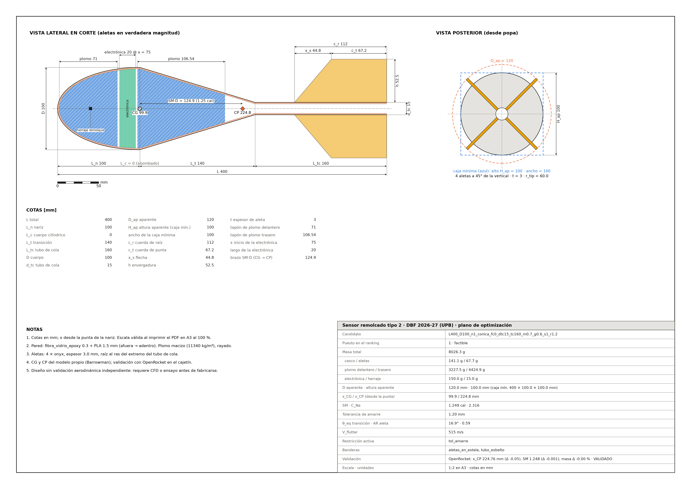
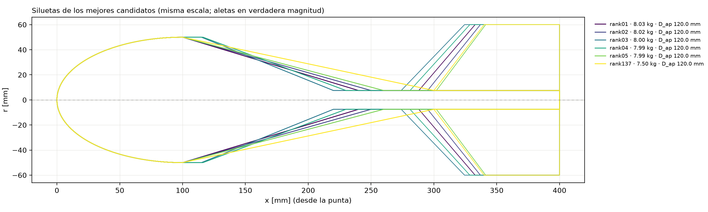
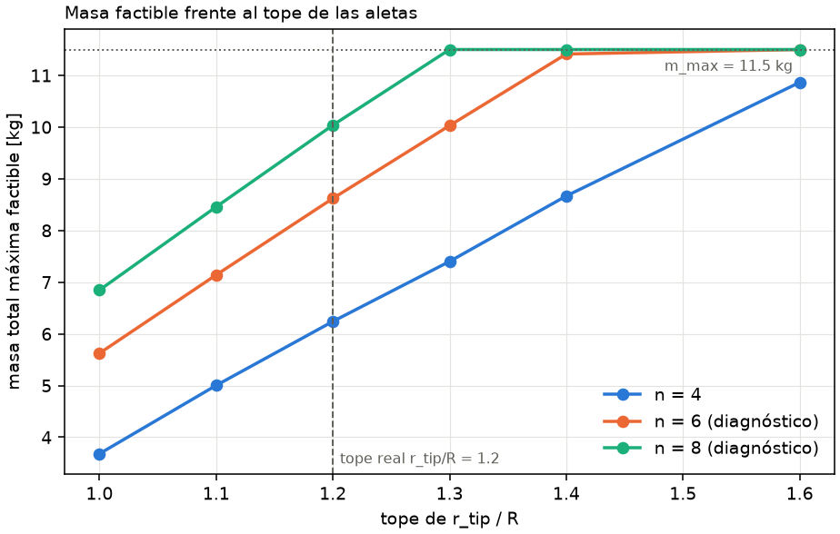
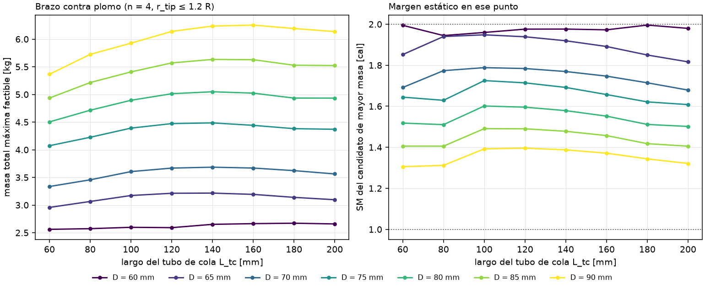

# sensor-tipo2 · DBF 2026-27 (UPB)

Optimización de la geometría y del lastre de plomo del **sensor remolcado tipo 2**
(`modelos/analisis_tipo2.ork`): nariz + cuerpo (cilíndrico o abombado) + transición + **tubo de
cola** delgado con aletas freeform montadas sobre el tubo. Sigue la metodología de
[`dbf-sensor`](https://github.com/Santyrios514/dbf-sensor) (`sensor_opt`): barrido en malla con un
modelo propio (Barrowman interno + llenado de plomo, sin JVM) y objetivo ponderado. OpenRocket 24.12
solo valida a los ganadores. El paquete es autocontenido; no importa `dbf-sensor`.

**Spec v2, revisión 2** (`SPEC_sensor_tipo2_v2.md`): aletas **dentro de 1.2 R**
($r_{tip} \le 1.2\,R$, restricción dura que nunca se relaja), $L = 400$ mm, cuerda de raíz
considerable, tubo de cola delgado, tope de 11.5 kg y criterios **masa ≫ D aparente ≫ SM ≫ taper**.
El entregable gráfico son **planos** (PNG y PDF), no archivos `.ork`. Lo que no es geometría
funciona como en `dbf-sensor`: pared fibra de vidrio 0.3 mm + PLA 1.5 mm, electrónica de 20 mm y
150 g, herraje de 15 g, plomo macizo con tapón delantero y trasero, amarre en el CG con tolerancia
mínima de **1.2 mm**, V = 30 m/s a 1495 m (ISA).

## ¿Es viable?

1. **Sí.** Con 4 aletas, $r_{tip} \le 1.2\,R$, $L = 400$ mm y D hasta 100 mm hay **16 096
   candidatos factibles** (de 62 108 evaluados); los 5 mejores validan con OpenRocket (ΔCP ≤ 0.06 mm,
   Δm ≤ 0.005 %).
2. Admite como máximo **8.02 kg**, el 70 % de los 11.5 kg, con D = 100 mm (otra vez el máximo de la
   malla) y D aparente de 120 mm; en toda la frontera la limita la tolerancia del amarre.
3. Para llegar a 11.5 kg, la concesión mínima es **8 aletas, sin pasar de $r_{tip} = 1.2\,R$** (o 6
   aletas a 1.3 R); con 4 aletas hace falta 1.6 R. El largo ya está en su tope; cada 10 mm de D
   suman 1.5–1.8 kg (D = 110 mm: 9.5 kg).

## Ganador (validado con OpenRocket 24.12)



Plano en A3, escala 1:2: [`docs/planos/rank01_…_r1.2.pdf`](docs/planos/rank01_L400_D100_n1_conica_fc0_dtc15_tc160_m0.7_g0.6_s1_r1.2.pdf)
(vectorial). Geometría para CAD/CFD: `data_opt/rank01_perfil.csv`.

| | `L400_D100_n1_conica_fc0_dtc15_tc160_m0.7_g0.6_s1_r1.2` |
|---|---|
| Cuerpo | **abombado** ($f_c = 0$, $L_c = 0$): nariz elipsoide de 100 mm + transición cónica de 140 mm |
| Tubo de cola | Ø 15 × 160 mm ($k = 0.15$: en los mínimos `k_min` y `d_tc_min_mm`) |
| Aletas (4, Onyx 3 mm) | $c_r$ 112, $c_t$ 67.2, flecha 44.8, $h$ 52.5 mm; $r_{tip}$ = 60 mm = **1.2 R**; AR 0.59 |
| D / D aparente / altura aparente | 100 / **120** / **100 mm** (caja mínima 400 × 100 × 100 mm) |
| Masa total | **8022 g**: plomo 7649 g (3228 delante de la electrónica + 4421 detrás), casco 141 g, aletas 68 g, electrónica 150 g, herraje 15 g |
| Herraje de remolque | **en el CG** (x = 99.98 mm), que es donde va el amarre: suma masa pero no mueve el CG |
| Electrónica | de x = 75 a 95 mm, dentro de la nariz ($r_i \ge 46$ mm) |
| $x_{CG}$ modelo / OpenRocket | 99.98 / 99.99 mm |
| $x_{CP}$ modelo / OpenRocket | 224.82 / 224.76 mm |
| $C_{N\alpha}$ | 2.316 = nariz 2.000 + transición −1.955 + aletas 2.271 (igual en OpenRocket) |
| SM modelo / OpenRocket | 1.248 / 1.248 cal |
| Tolerancia de amarre | **1.20 mm**: es la restricción que limita la masa |
| $\theta_{eq}$ de la transición · $C_D$ (OpenRocket) | 16.9° · 0.207 |
| Banderas | `aletas_en_estela` (16.9° > 12°), `tubo_esbelto` ($L_{tc}/d_{tc}$ = 10.7 > 8); flutter 515 m/s |

**Con D = 100 mm la estela ya no es gratis.** A igual largo, un cuerpo más grueso necesita una
transición más empinada. El ganador lleva el cono a 16.9°, y el mejor candidato sin banderas pierde
0.53 kg, mucho más que los 116 g que el objetivo considera indistinguibles. Masa máxima según el
ángulo de transición que se acepte (todas con D = 100 mm):

| $\theta_{eq}$ máximo | 11° | **12°** | 13° | 14° | 15° | 16° | sin límite |
|---|---|---|---|---|---|---|---|
| masa [kg] | 7.31 | **7.49** | 7.69 | 7.83 | 7.99 | 8.02 | 8.02 |
| $L_{tc}$ [mm] · $L_{tc}/d_{tc}$ | 80 · 5.3 | 100 · 6.7 | 110 · 7.3 | 120 · 8.0 | 140 · 9.3 | 150 · 10.0 | 160 · 10.7 |

**Alternativa sin banderas (recomendada para la validación independiente):** puesto 137,
`L400_D100_n1_conica_fc0_dtc15_tc100_m1_g0.6_s1_r1.2`. Tiene el mismo cuerpo con el tubo de cola
de 100 mm, la transición de 200 mm (θ = 12.0°, $L_{tc}/d_{tc}$ = 6.7) y aletas de cuerda 100 mm:
**7492 g** (−530 g), SM 1.185 (OpenRocket 1.184), $C_D$ 0.172, validado (ΔCP −0.05 mm). Plano:
[`docs/planos/rank137_…_r1.2.pdf`](docs/planos/rank137_L400_D100_n1_conica_fc0_dtc15_tc100_m1_g0.6_s1_r1.2.pdf).
El umbral de 12° es un aviso, no una restricción: si el equipo acepta 14°, el puesto 25 (tubo de
120 mm) da 7.83 kg.



### Validación de los 5 mejores (`02_validar_ganadores.py`)

Criterio: $|\Delta x_{CP}| \le 2$ mm, $|\Delta m| \le 0.5\,\%$ y $SM_{OR} \in [1, 2]$.

| Puesto | $L_{tc}$ / $f_c$ | masa modelo [g] | Δm OR | $x_{CP}$ modelo / OR [mm] | Δ$x_{CG}$ | SM modelo / OR | $C_D$ OR | ¿Valida? |
|---|---|---|---|---|---|---|---|---|
| 1 | 160 / 0 | 8022.4 | −0.004 % | 224.82 / 224.76 | +0.004 mm | 1.248 / 1.248 | 0.207 | sí |
| 2 | 150 / 0 | 8019.4 | −0.004 % | 224.87 / 224.82 | +0.004 mm | 1.259 / 1.258 | 0.201 | sí |
| 3 | 180 / 0.125 | 7992.5 | −0.004 % | 216.36 / 216.30 | +0.004 mm | 1.227 / 1.226 | 0.230 | sí |
| 4 | 170 / 0.125 | 7990.3 | −0.004 % | 216.01 / 216.02 | +0.004 mm | 1.233 / 1.233 | 0.225 | sí |
| 5 | 140 / 0 | 7987.0 | −0.004 % | 224.67 / 224.62 | +0.004 mm | 1.267 / 1.266 | 0.196 | sí |
| 137 (extra) | 100 / 0 | 7492.4 | −0.004 % | 210.91 / 210.86 | +0.004 mm | 1.185 / 1.184 | 0.172 | sí |

El ganador es un "dardo" abombado: la nariz roma concentra el plomo adelante, y la transición
larga es a la vez la más suave y el brazo que separa la fuerza negativa de la transición de la
positiva de las aletas. Los cuerpos con tramo cilíndrico pierden poco ($f_c = 0.25$: 7.90 kg), pero
acortan la transición y dejan las aletas de lleno en la estela.

## Frontera de factibilidad (`03_frontera_factibilidad.py`)

Mejor masa factible por tope de $r_{tip}/R$ y número de aletas, sobre la malla completa (295 968
evaluaciones, sin refinamiento). Solo las filas **n = 4, tope ≤ 1.2** cumplen la spec; el resto es
**diagnóstico** y no entra al ranking.

| n | tope $r_{tip}/R$ | factibles | masa máx. [kg] | D aparente [mm] | SM [cal] | tol. amarre [mm] | activa |
|---|---|---|---|---|---|---|---|
| **4** | **1.0** | 665 | **4.98** | 100 | 1.10 | 1.20 | tol_amarre |
| **4** | **1.1** | 4 873 | **6.56** | 110 | 1.19 | 1.20 | tol_amarre |
| **4** | **1.2** | 15 648 | **8.02** | 120 | 1.25 | 1.20 | tol_amarre |
| 4 | 1.3 | 25 913 | 9.43 | 130 | 1.25 | 1.20 | tol_amarre |
| 4 | 1.4 | 37 844 | 10.81 | 140 | 1.28 | 1.20 | tol_amarre |
| 4 | 1.6 | 49 725 | 11.50 | 160 | 1.13 | 1.26 | masa |
| 6 | 1.0 | 3 761 | 7.48 | 100 | 1.24 | 1.20 | tol_amarre |
| 6 | 1.1 | 18 246 | 9.17 | 110 | 1.25 | 1.20 | tol_amarre |
| 6 | 1.2 | 40 183 | 10.92 | 120 | 1.27 | 1.20 | tol_amarre |
| 6 | 1.3 | 52 238 | 11.50 | 130 | 1.33 | 1.35 | masa |
| 6 | 1.4 | 64 080 | 11.50 | 140 | 1.19 | 1.21 | masa |
| 6 | 1.6 | 75 300 | 11.50 | 160 | 1.24 | 1.68 | masa |
| 8 | 1.0 | 6 761 | 8.93 | 100 | 1.30 | 1.20 | tol_amarre |
| 8 | 1.1 | 26 850 | 10.86 | 110 | 1.27 | 1.20 | tol_amarre |
| 8 | 1.2 | 50 711 | 11.50 | 120 | 1.17 | 1.22 | masa |
| 8 | 1.3 | 62 569 | 11.50 | 130 | 1.20 | 1.43 | masa |
| 8 | 1.4 | 74 117 | 11.50 | 140 | 1.26 | 1.45 | masa |
| 8 | 1.6 | 84 815 | 11.50 | 140 | 1.26 | 1.45 | masa |



### Brazo contra plomo: masa y SM frente a $L_{tc}$



Cada mm de tubo de cola es un mm menos de plomo, pero es el brazo de las aletas. La masa crece hasta
$L_{tc}$ ≈ 160 mm (D = 100: 8.02 kg; D = 90: 6.25 kg) y luego cae; con D = 60 mm la curva es casi
plana. Con D = 100 mm la caída pasados los 160 mm es más fuerte (200 mm: 7.40 kg), porque la
transición se acorta y se empina. $L_{tc}$ = 40 mm no tiene factibles: la cuerda mínima de 50 mm no
cabe. Masa máxima por D (con refinamiento):

| D [mm] | 60 | 65 | 70 | 75 | 80 | 85 | 90 | 95 | 97.5 | 100 |
|---|---|---|---|---|---|---|---|---|---|---|
| masa [kg] | 2.67 | 3.21 | 3.68 | 4.48 | 5.04 | 5.63 | 6.25 | 6.90 | 7.45 | **8.02** |
| SM [cal] | 2.00 | 1.92 | 1.77 | 1.69 | 1.58 | 1.48 | 1.37 | 1.29 | 1.27 | 1.25 |

(Con D hasta 90 mm, el refinamiento a medio paso había subido de 6.25 a 6.45 kg bajando $k$ a 0.175.
Con D = 100 mm el tubo de 15 mm ya es $k$ = 0.15, el mínimo, y el refinamiento no mejora al mejor.)

Con la tolerancia de amarre activa,

$$m \le \frac{\alpha_{max}\,q\,S_{ref}\,C_{N\alpha}\,(x_{CP}-x_{CG})}{g\,\text{tol}_{min}}$$

así que cada aleta más, cada mm de envergadura y cada mm de D suben $C_{N\alpha}(x_{CP}-x_{CG})$, y con
él la masa admisible. El SM en calibres sí baja con D (de 2.0 a 1.25): el brazo $x_{CP}-x_{CG}$ casi
no cambia (120–126 mm), pero se divide por un D mayor. El escalado con $n$ usa el factor de
interferencia de `FinSetCalc` (abajo), que es optimista para aletas tan juntas sobre un tubo de 15 mm.

## Por qué las aletas dentro del calibre sí estabilizan

Una versión anterior de este README decía que con $r_{tip} \le R$ el sensor nunca podía ser
estable porque, por cuerpos esbeltos, transición + aletas suman $C_{N\alpha} \le 0$. **La suma sí es
≤ 0, pero la conclusión era falsa**: las dos fuerzas no actúan en el mismo punto. La transición
aporta una fuerza negativa en su centroide y las aletas una positiva al final del tubo de cola.
Juntas forman un **par** que lleva el CP hacia atrás aunque la fuerza neta sea casi cero, como dos
manos que giran un volante sin empujarlo:

$$x_{CP}=\frac{2\,x_n + C_{N\alpha,t}\,x_t + C_{N\alpha,f}\,x_f}{2 + C_{N\alpha,t} + C_{N\alpha,f}}$$

En el ganador: nariz +2.000 en 33 mm, transición −1.955 en 153 mm y aletas +2.271 en 331 mm, así que
$x_{CP} = 224.8$ mm aunque las aletas solo salgan 10 mm por fuera del cuerpo. Lo que manda es el
brazo $x_f - x_t$: el `.ork` original (tubo de 50 mm, transición de 65 mm) tiene un brazo corto y
su CP queda delante de la nariz (−133.6 mm). `tests/test_lastre.py` lo comprueba con $r_{tip} = R$.

## PENDIENTES (supuestos de la spec por confirmar)

Sensibilidad: malla por defecto completa **sin refinamiento** (referencia **8.02 kg**, la misma del
ganador), cambiando un parámetro a la vez.

| Parámetro | Valor usado | Variación → masa máxima [kg] (Δ) |
|---|---|---|
| `electronica.r_min_mm` | `null` | 15 → **8.79** (+0.77) · 25 → **8.77** (+0.75) · 35 → 8.56 (+0.54) |
| `restricciones.d_tc_min_mm` | 15 | 12 → 8.17 (+0.15) · 20 → 7.56 (−0.47) · 25 → 7.05 (−0.97) |
| `restricciones.c_r_min_mm` | 50 | 30, 80 y 100 → 8.02 (sin cambio: el óptimo usa $c_r$ = 112 mm) |
| `restricciones.L_n_rel_D_min` | 1.0 | 0.75 → 8.16 (+0.14) |
| D máximo (`malla.D_mm`) | **100** (el equipo lo subió de 90) | 90 → 6.25 (−1.78) · 110 → **9.51** (+1.48; D aparente 132 mm) |
| `masa.m_max_g` | 11500 | no activo |
| `remolque.tol_amarre_min_mm` | 1.2 (la spec supone 1.5) | 1.5 → **7.00** (−1.02) |

- **`r_min_mm` es la palanca más barata.** Con `null` la electrónica tiene que terminar antes de la
  transición, y en un cuerpo abombado eso es dentro de la nariz (en el ganador cabe con holgura:
  $r_i \ge 46$ mm). Con un valor, la electrónica puede bajar a la transición mientras
  $r_i \ge r_{min}$, y el plomo que queda delante adelanta el CG. Si la electrónica cabe en un radio
  de 25 mm, conviene fijarlo.
- **El tubo de cola ya está en su mínimo** ($d_{tc}$ = 15 mm, $k$ = 0.15): bajarlo a 12 mm da poco
  (+0.15 kg), subirlo cuesta bastante (20 mm: −0.47 kg). La cuerda mínima no está activa: con
  envergadura pequeña el $C_{N\alpha}$ de las aletas se satura con la cuerda, y el óptimo ya usa
  cuerdas de 100 mm o más.
- **La tolerancia de amarre es casi lineal en la masa**: 1.2/1.5 × 8.02 = 6.4 kg; el óptimo se
  reacomoda (tubo más largo) y queda en 7.00 kg.
- **D sigue activo**: la masa crece ≈ 0.55 kg cada 2.5 mm cerca de 100 mm. El límite real lo pone la
  bahía del Barracuda, no el sensor.
- **Tolerancias implícitas** (`tolerancias_implicitas.json`): un criterio inferior compensa como
  mucho **116 g** de masa, **0.61 mm** de D aparente y **0.010 cal** de SM. La de diámetro ya no
  tiene sentido físico como compensación: está por debajo del paso más fino del D aparente
  (D cada 5 mm y $r_{tip}$ cada 0.05 R dan pasos de 3–6 mm, y ≥ 1.5 mm aun tras el refinamiento a
  medio paso), así que el criterio 2 actúa como lexicográfico estricto. La de SM solo desempata.

## Cómo funciona

```
config/optimizacion.yaml ──► 01_optimizar_malla.py ──► data_opt/ranking.csv ──► 04_planos.py ──► planos/*.png, *.pdf
                              (modelo propio, sin JVM)                               (sin JVM)
                         ──► 03_frontera_factibilidad.py ──► frontera_factibilidad.csv, masa_vs_tope.png,
                              (siempre; sin JVM)              masa_vs_Ltc.png, casi_factibles.csv
                         ──► 02_validar_ganadores.py (opcional, OpenRocket) ──► validacion_or.csv
                              (si corre antes de 04, los planos muestran la validación)
```

1. **Variables, por prioridad** (resolución de la malla según el criterio al que sirven):

   | Grupo | Variables | Malla |
   |---|---|---|
   | A · masa | $D$ (60–100 mm), $L_{tc}$, $f_c$, $L_n/D$ | 9 × 9 × 4 × 2 |
   | B · diámetro aparente | $r_{tip}/R \le 1.2$ | 5 |
   | C · estabilidad | $k = d_{tc}/D$ | 5 |
   | D · ajuste fino | $\mu = c_r/L_{tc}$, $\gamma$, $\sigma$, forma de la transición | 2 × 1 × 2 × 2 |

   $L = 400$ mm fijo, $L_{disp} = L - L_n - L_{tc}$, $L_c = f_c\,L_{disp}$ y $L_t = (1-f_c)\,L_{disp}$
   ($f_c = 0$: cuerpo abombado). Aletas: $c_r = \mu L_{tc} \ge 50$ mm, $c_t = \gamma c_r$,
   $x_s = \sigma(c_r - c_t)$, raíz al ras del extremo del tubo. 6 480 cuerpos × 20 aletas = 129 600
   candidatos; 61 660 tras descartar los geométricamente imposibles. El refinamiento a medio paso
   alrededor de los 10 mejores toca solo los grupos A, B y C. La corrida completa tarda ≈ 30 s.
2. **Perfil y cavidad.** Funciones de forma de OpenRocket (incluida la transición `clipped`);
   cavidad por erosión morfológica del perfil por las capas de pared; volumen y momento acumulados
   por Simpson:
   $$\forall(x)=\int_0^x \pi r_i^2\,dx,\qquad \Phi_1(x)=\int_0^x \pi r_i^2\,x\,dx$$
3. **CP (modelo propio).** Barrowman general para nariz (+2) y transición ($2(k^2-1)$) y franjas para
   las aletas, como `FinSetCalc`:
   $$C_{N\alpha,1}=\frac{2\pi s^2/A_{ref}}{1+\sqrt{1+\left(\beta s^2/(A_f\cos\Gamma)\right)^2}},\qquad
   C_{N\alpha,f}=C_{N\alpha,1}\,\frac{n}{2}\,f_n\left(1+\frac{r_{tc}}{s+r_{tc}}\right)$$
   con $f_n$ = 1 (n ≤ 4), 0.948, 0.913, 0.854, 0.81 (n = 5–8) y 0.75 (n > 8), leído de
   `FinSetCalc.calculateNonaxialForces` (OpenRocket 24.12) y verificado con 6 y 8 aletas (T7).
4. **Llenado de plomo** (idéntico a `dbf-sensor`). Electrónica detrás del tapón delantero:
   $$x_{CG}(\ell)=\frac{M_0+\rho_b\,\Phi_1(\ell)+m_e\,\bar x_e(\ell)}{m_0-m_{cg}+\rho_b\,\forall(\ell)+m_e},\qquad SM=\frac{x_{CP}-x_{CG}}{D}$$
   El herraje de remolque ($m_{cg}$ = 15 g, `x_mm: cg`) va en el CG, donde está el amarre: entra en la
   masa total (y en la tolerancia del amarre), pero no en el momento, así que no mueve el CG.
   Con `electronica.r_min_mm`, $x_e(\ell) = \max(x_{b0}+\ell+h,\ x_a)$ y
   $\ell_{geo} = x_b - L_e - 2h - x_{b0}$, con $[x_a, x_b]$ el tramo con $r_i \ge r_{min}$. Primero el
   tapón delantero hasta $SM = SM_{min}$ o la geometría; luego el trasero; después el tope
   $m_{max}$ y por último el retroceso hasta cumplir
   $$\text{tol}_{amarre}=\frac{\alpha_{max}\,q\,S_{ref}\,C_{N\alpha}\,(x_{CP}-x_{CG})}{m g}\ \ge\ 1.2\text{ mm}$$
5. **Objetivo** ($w = (10^6, 10^4, 10^2, 1)$ en el orden de `objetivo.orden`):
   $$f_1=\frac{m_{max}-m}{m_{max}},\quad f_2=\frac{D_{ap}-D_{lo}}{D_{hi}-D_{lo}},\quad
   f_3=\frac{SM_{max}-SM}{SM_{max}-SM_{min}},\quad f_4=\frac{k_{ef}-k_{lo}}{1-k_{lo}}$$
   con $D_{ap} = 2\max(R, r_{tip})$ y $k_{ef}=\sqrt{k^2+f_b(1-k^2)}$. SM ∈ [1, 2] es restricción
   dura y, dentro del rango, se prefiere el mayor: el modelo es optimista con las aletas en la
   estela, así que a igual masa y diámetro vale más el margen que el arrastre.
   `objetivo.orden: [masa, diametro, taper, SM]` vuelve al orden de `dbf-sensor`.
6. **Banderas** (informativas): `aletas_en_estela` si
   $\theta_{eq} = \arctan\big((R - r_{tc})/L_t\big) > 12°$, `tubo_esbelto` si $L_{tc}/d_{tc} > 8$,
   `frac_h_fuera_sombra` $= \max(0, r_{tip} - R)/h$ y AR $= h^2/A_f$.
7. **Validación con OpenRocket** (solo ganadores): los 5 mejores factibles se arman sobre la
   plantilla `analisis_tipo2.ork` con el plomo, la electrónica y el herraje como *Mass components*.
   Valida si $|\Delta x_{CP}| \le 2$ mm, $|\Delta m| \le 0.5\,\%$ y $SM_{OR} \in [1, 2]$; el ganador es
   el primero que valida. Si alguno supera la tolerancia de CP, el script se detiene y lo reporta
   (código 5): no hay calibración. No se guarda ningún `.ork`.

## Planos (`04_planos.py`)

Uno por cada uno de los `salida.N_planos` mejores (y por cada `--cand`), en `planos/rankNN_<cand_id>.png`
(300 dpi) y `.pdf` (vectorial): hoja A3 a la mayor escala normalizada que cabe (1:2 con L = 400 mm),
con vista lateral en corte (pared por capas, tapones de plomo rayados, electrónica, herraje, tubo y
aletas en verdadera magnitud, CG y CP con el brazo SM·D acotado), vista posterior (aletas, círculo
del D aparente y **caja mínima** con la altura aparente acotada), cotas en mm, tabla de cotas, barra de escala y cajetín (masas,
estabilidad, $\theta_{eq}$, AR, $V_{flutter}$, restricción activa, banderas y la línea de validación
con OpenRocket o "sin validar"). Además, `planos/comparativo_top.png` (siluetas superpuestas) y
`data_opt/rankNN_perfil.csv` ($x$, $r_e$, $r_i$ y polígono de la aleta) para CAD/CFD. Sin
factibles, dibuja los 3 primeros casi factibles con el rótulo INFACTIBLE.

**Altura aparente** $H_{ap}$: la menor altura de una caja que contiene al sensor acostado, girándolo
sobre su eje y contando el espesor real de las aletas,
$H_{ap} = \min_\varphi\,[y_{max}(\varphi) - y_{min}(\varphi)]$. Con 4 aletas el mínimo está a 45° y
$H_{ap} = \max\big(2R,\ \sqrt2\,(r_{tip} + t/2)\big)$: las aletas no suben la caja mientras
$r_{tip} \le \sqrt2\,R - t/2$ (≈ 1.38 R). Con el tope de 1.2 R **todos los candidatos tienen
$H_{ap} = D$**; el ganador cabe en una caja de 400 × 100 × 100 mm, aunque su D aparente frontal sea
de 120 mm. Está en el ranking (`H_ap_mm`, `ancho_caja_mm`, `giro_caja_deg`).

Los planos son deterministas: la misma entrada da los mismos bytes en PNG y PDF (sin fecha de
creación incrustada). La metodología completa, las versiones exactas (`requirements-lock.txt`) y
las huellas de referencia (`docs/planos/SHA256SUMS`) están en
[`docs/METODOLOGIA_PLANOS.md`](docs/METODOLOGIA_PLANOS.md).

## Validación del modelo

| Comparación | Diferencia |
|---|---|
| `.ork` base, CP total | −133.636 mm (modelo) vs −133.646 mm (OpenRocket) |
| 6 candidatos validados (D = 100) y 6 más con D = 90 | ΔCP ≤ 0.06 mm, $C_{N\alpha}$ idéntico, Δm ≤ 0.005 %, ΔCG ≤ 0.004 mm |
| Cuerpo abombado ($L_c = 0$, T4) | perfil ≤ 0.02 mm, CP ≤ 0.06 mm; casco: transición y tubo 0.02 %, nariz 0.53 % (abajo) |
| 6 y 8 aletas (T7) | $C_{N\alpha}$ relativo ≤ 10⁻³, $x_{CP}$ ≤ 0.1 mm |
| Llenado (T2) | 230 casos dorados de la versión anterior (`tests/datos/llenado_v1.csv`); 274 casos idénticos a `dbf-sensor/sensor_opt` |

**Masa de la nariz frente a OpenRocket (0.53 %).** OpenRocket integra cada componente con 128
troncos de cono y mide la pared en vertical sobre la secante, $r_i = r - t/\cos\theta$. En una nariz
roma y curva eso da menos pared que un espesor normal uniforme, que es lo que calcula la erosión del
modelo. T4 replica el esquema de OpenRocket sobre el mismo perfil y reproduce su masa al 0.01 %: la
geometría coincide y la diferencia es el esquema (0.27 g en una nariz de 90 mm). Por eso T4 exige < 0.1 % en
transición y tubo de cola, y < 1 % en la nariz, en lugar del 0.1 % de la spec en todo el casco.

**Corrección del puente con OpenRocket.** OpenRocket admite una sola capa de pared. Antes se usaba
la densidad ponderada por espesor, que vale para paredes planas. En un tubo de Ø 16 mm la capa
exterior (fibra, más densa) tiene más área que la interior, y la pared quedaba 0.7 % liviana. Ahora
la densidad equivalente es masa de las capas / volumen de la pared, por estación.

## Instalación y uso

```bash
pip install -e ".[dev]"            # numpy, scipy ≥ 1.12, pandas, pyyaml, matplotlib, pytest
pip install -e ".[openrocket]"     # solo para el script 02: orlab + JPype (JDK 17 o 21)
python -m orlab fetch 24.12        # o ORLAB_JAR=/ruta/OpenRocket-24.12.jar

python scripts/01_optimizar_malla.py           # ranking (≈ 30 s) [--config ...] [--procesos N] [--sin-figuras]
python scripts/03_frontera_factibilidad.py     # frontera r_tip/R × n, masa vs L_tc (≈ 3 min) [--gruesa]
python scripts/02_validar_ganadores.py         # opcional, OpenRocket [--cand ID ...]
python scripts/04_planos.py                    # planos PNG + PDF [--cand ID ...] [--n N]
python scripts/05_tolerancia_amarre.py x.ork   # tolerancia de amarre de cualquier .ork (OpenRocket) [--mach M]
pytest                                         # los de OpenRocket se saltan sin java/orlab
```

Variantes: un YAML con `hereda: optimizacion.yaml` cambia solo lo que declara
(`config/optimizacion_6200g.yaml`: tope de 6.2 kg).

## Configuración (`config/optimizacion.yaml`)

| Sección | Qué define |
|---|---|
| `materiales`, `costos_usd_kg` | densidades (kg/m³) y precio del plomo |
| `masa` | tope de masa total (11.5 kg) |
| `pared` | capas de afuera hacia adentro, por estación (`nariz`, `cuerpo`, `cola`, `tubo_cola`) |
| `electronica`, `masas_puntuales` | electrónica (20 mm, 150 g, `r_min_mm`) y herraje de remolque (15 g, `x_mm: cg`: en el CG, donde va el amarre) |
| `lastre` | radio mínimo útil, fracción máxima de L, margen antes de la transición, tapón trasero |
| `condiciones_vuelo`, `remolque`, `envolvente` | V, altitud ISA, Mach; α de trim y tolerancia mínima del amarre (1.2 mm); rotación de guardado |
| `geometria_fija` | nariz elipsoide, transición recortada, aletas (n, material, espesor 3 mm, flutter) |
| `malla` | grupos A ($D$, $L_{tc}$, $f_c$, $L_n/D$), B ($r_{tip}/R$), C ($k$) y D ($\mu$, $\gamma$, $\sigma$, forma); $L$ |
| `restricciones` | $L_{max}$, SM ∈ [1, 2], **$r_{tip}/R \le 1.2$** (error de configuración si la malla lo pasa), $L_n/D \ge 1$, $c_r \ge 50$ mm, $k_{min}$, $d_{tc} \ge 15$ mm, avisos de esbeltez y estela, base roma |
| `objetivo` | `orden`, `pesos`, `diametro` (aparente), `f_SM_modo` (max) |
| `ejecucion` | paralelo, `max_evaluaciones`, refinamiento, `validacion_or` (N_ganadores, tol_cp_mm, tol_masa_pct) |
| `numerico`, `openrocket`, `salida` | discretización, plantilla `.ork`, carpetas (`dir`, `dir_figuras`, `dir_planos`) y `N_planos` |

## Salidas

- `data_opt/`: `ranking.csv` (todos los candidatos: `factible`, `motivos`, $f_1$…$f_4$, J, geometría,
  banderas, masas, CG, CP, SM, tolerancia y, tras el script 02, `validado_or` y `ganador`),
  `pareto.csv`, `frontera_masa_D.csv`, `frontera_factibilidad.csv`, `masa_vs_Ltc.csv`,
  `casi_factibles.csv` (solo sin factibles), `validacion_or.csv`, `tolerancias_implicitas.json` y
  `rankNN_perfil.csv`.
- `planos/`: `rankNN_<cand_id>.png` y `.pdf` y `comparativo_top.png`.
- `figs_opt/`: `pareto.png`, `factibilidad.png`, `sensibilidad.png`, `frontera_masa_D.png`,
  `masa_vs_tope.png` y `masa_vs_Ltc.png`.

`docs/` guarda una copia de los planos del ganador y de la alternativa sin banderas, y de las
figuras de la frontera, para verlas en GitHub.

## Hipótesis y limitaciones

- **Barrowman no modela la estela de la transición sobre aletas dentro del calibre.** Con
  $r_{tip} = 1.2\,R$ solo el 19 % de la envergadura sale de la sombra del cuerpo, y el ganador tiene
  una transición de 16.9°. Si el flujo se separa, las aletas pierden sustentación, el CP real queda
  más adelante y el SM real (1.25 en el modelo) puede caer por debajo de 1. La alternativa del puesto
  137 (12.0°) reduce el riesgo, no lo elimina.
- **El escalado con $n$ es optimista.** Las filas de 6 y 8 aletas usan el factor de interferencia
  de OpenRocket, pensado para aletas sobre el cuerpo de un cohete, no para 8 aletas de 52 mm sobre un
  tubo de 15 mm.
- **El ganador necesita una validación independiente (CFD o ensayo) antes de fabricarse.**
- **El tubo de cola no se verifica estructuralmente**: Ø 15 mm con 1.8 mm de pared y 160 mm de
  largo cargando las aletas ($L_{tc}/d_{tc}$ = 10.7). Revisen rigidez y la carga de despliegue.
- Con `electronica.r_min_mm: null`, la electrónica de los cuerpos abombados queda dentro de la nariz
  sin que el modelo revise su radio; en el ganador sobra ($r_i \ge 46$ mm), pero confirmen el valor.
- OpenRocket avisa *"Zero-volume bodies may not simulate accurately"* por el cuerpo de largo 0;
  el CP y las masas no se ven afectados.
- Subsónico, ángulos pequeños, flujo libre; no incluye la estela del avión ni la del cable. Trim
  estático y lineal; la electrónica es una masa uniforme de diámetro completo.
- El plomo no se funde dentro del casco (327 °C frente a ~60–80 °C del PLA): se funde o mecaniza
  aparte y debe quedar retenido frente al despliegue y el tirón del cable.

## Historia

- **v1** (`modelos/v1/`): aletas dentro del D acostado ($r_{tip} = \sqrt2\,R$), 10.15 kg con
  D = 105 mm. **No cumplen la spec v2** ($r_{tip} > 1.2\,R$); se guardan como referencia.
- **v2**: aletas dentro de 1.2 R, cuerpo abombado, tubo delgado, estudio de factibilidad.
- **v2, revisión 2** (esta): malla por grupos, SM antes que taper, planos en lugar de `.ork` y
  OpenRocket solo para validar a los ganadores, sin calibración. Con D hasta 90 mm el ganador era de
  6.45 kg (D aparente 108 mm); el equipo subió el D máximo a 100 mm.

## Estructura

```
config/     optimizacion.yaml (única fuente de parámetros), optimizacion_6200g.yaml (variante)
modelos/    analisis_tipo2.ork (geometría de referencia y plantilla de la validación), v1/ (diseños anteriores)
docs/       planos y figuras de la frontera para este README
scripts/    01_optimizar_malla.py, 02_validar_ganadores.py, 03_frontera_factibilidad.py, 04_planos.py
src/sensor_tipo2/
  config.py        YAML → SI, validación, malla de cuerpos y aletas, herencia
  perfiles.py      funciones de forma de OpenRocket; perfil nariz–cuerpo–transición–tubo
  geometria.py     erosión por capas, cavidad, tramo de electrónica, masas de pared, Barrowman del cuerpo
  aletas.py        aleta sobre el tubo de cola, Barrowman por franjas, interferencia por n, flutter
  lastre.py        llenado de plomo (delantero, trasero, tope de masa, tolerancia de amarre)
  sustituto.py     CP del modelo propio con guarda
  objetivo.py      f1..f4 en el orden configurable, J, tolerancias implícitas, Pareto
  barrido.py       prefiltro, evaluación en paralelo, banderas, ranking, refinamiento (grupos A, B, C)
  frontera.py      frontera de factibilidad (tope × n), masa vs L_tc, casi factibles
  planos.py        planos A3 (PNG y PDF), comparativo de siluetas
  verificacion.py  puente con OpenRocket (único módulo con Java) y validación de los ganadores
  exportar.py      CSV, JSON, perfiles y figuras de análisis
tests/      pytest (T1–T13: geometría, aletas, lastre, objetivo, barrido, planos, scripts y OpenRocket)
```
